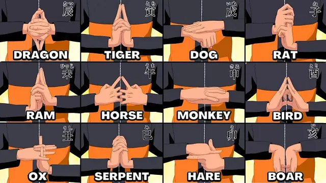
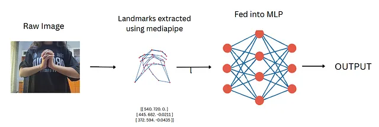
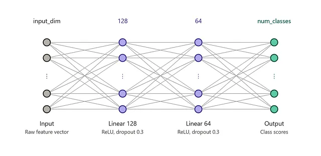

# naruto-hand-signs

This recognizes Naruto hand signs from a live webcam feed. MediaPipe handles the hand tracking, and a small MLP does the actual classification on top of that.

A handful of signs from the Naruto series, each mapped to a class the model can recognize. The dataset covers a fixed set of these, captured across different people, lighting, and backgrounds to keep the model from overfitting to one setup:

MediaPipe's HandLandmarker pulls 21 landmarks out of each detected hand. Those get normalized relative to the wrist and scale, then concatenated by handedness so a two-handed sign and a one-handed sign end up as consistent-length vectors. That vector is what gets passed into the model.

The model is a small MLP: input_dim to 128 to 64 to num_classes, with ReLU and dropout after the first two layers. Nothing exotic, it just needed to separate the sign classes well enough on landmark data, and this was enough.

Landmark extraction only happens once and gets cached to `features.npz`, so training doesn't have to recompute it on every run.

One thing to be aware of with the dataset: images where MediaPipe can't detect a hand at all get dropped, since there's no landmark to extract. That removes a meaningful chunk of the raw images, so it's worth knowing if you're extending the dataset yourself.

I wrote up the full process in more detail here, including the reasoning behind some of these choices and where it still falls short: https://medium.com/@roha-pathan125/naruto-hand-signs-recognition-using-cnns-yolo-mediapipe-mlp-a71d6b3ab4b4?sharedUserId=roha-pathan125

### what's in here

- `live.py` — runs inference in real time off your webcam
- `train.ipynb` — the training pipeline, extraction through training through evaluation
- `take-images.py` — helper script to build your own dataset from scratch
- `model.pt` — the trained model